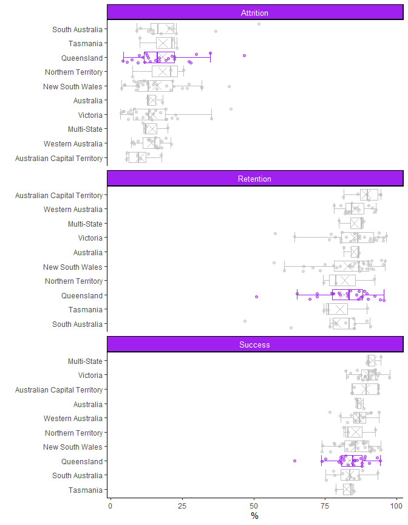
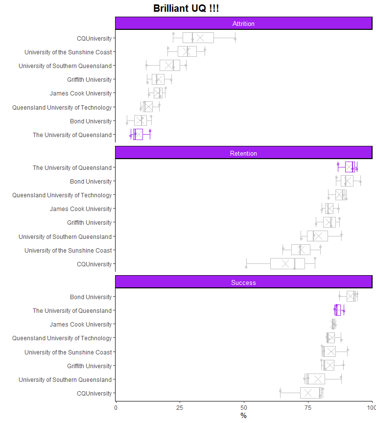
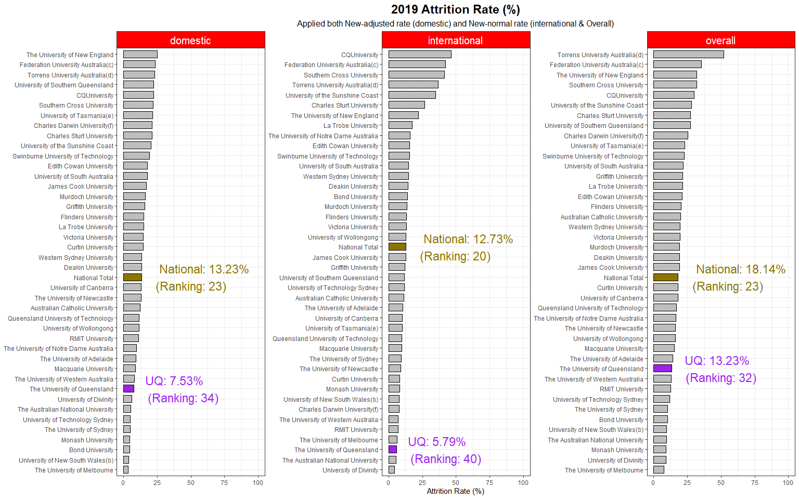
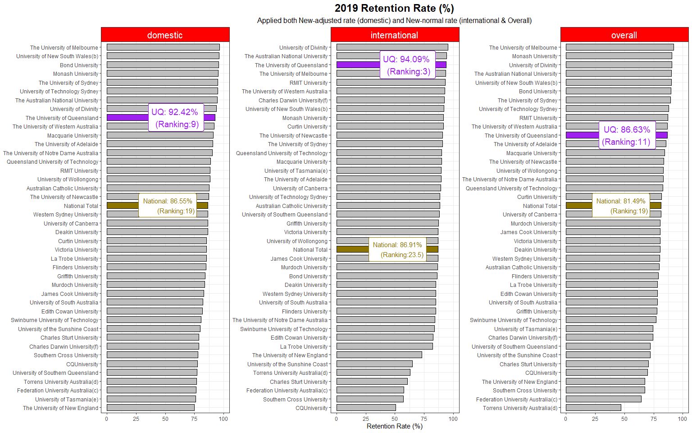
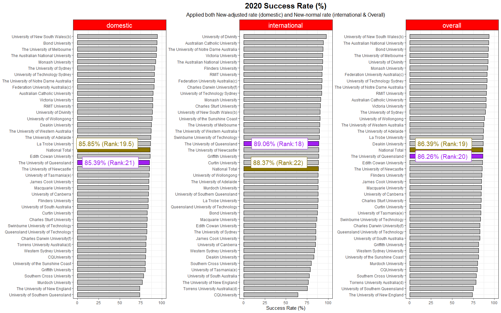
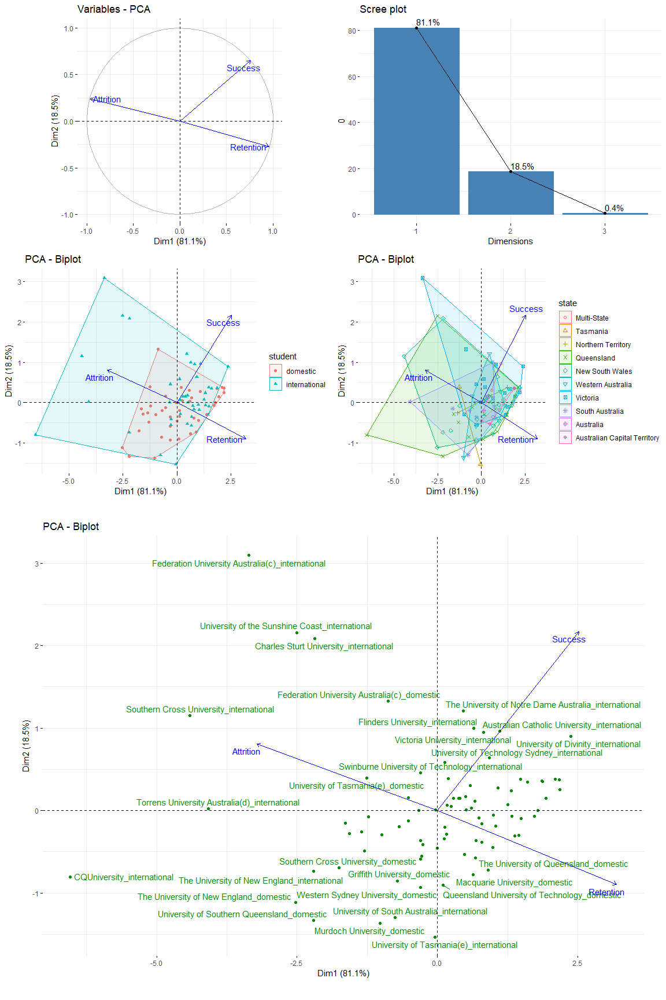

Student Retention Rate of AUS Universities
================
Kar Ng
2022-07-23

-   [1 SUMMARY](#1-summary)
-   [2 R PACKAGES](#2-r-packages)
-   [3 DATA PREPARATION](#3-data-preparation)
    -   [3.1 Data Import](#31-data-import)
    -   [3.2 Data Cleaning](#32-data-cleaning)
    -   [3.3 Data Exploration](#33-data-exploration)
-   [4 VISUALISATION](#4-visualisation)
    -   [4.1 Qld ranking in Australia](#41-qld-ranking-in-australia)
    -   [4.2 UQ ranking in Queensland](#42-uq-ranking-in-queensland)
    -   [4.3 UQ Attrition Ranking (2019)](#43-uq-attrition-ranking-2019)
    -   [4.4 UQ Retention Ranking (2019)](#44-uq-retention-ranking-2019)
    -   [4.5 UQ Success Ranking (2020)](#45-uq-success-ranking-2020)
    -   [4.6 PCA](#46-pca)
-   [5 CONCLUSION](#5-conclusion)
-   [6 REFERENCE](#6-reference)

# 1 SUMMARY

This project analyses the statistics of retention, attrition and success
rate of Universities in Australia with a focus on the University of
Queensland (UQ). Data set used in this project is a publicly available
data set downloaded from the website of the Department of Education,
Skills and Employment (DESE), Australia Government. The insights of this
project are based on statistics in 2019 and 2020. Years will be
specified in graphs.

Imported raw data were very messy. A series of carefully-designed data
processing techniques were applied to clean and transform the data.
There are 7 visualisation tasks in this project. Most of the tasks were
accomplished using customised visualisation techniques and the last task
was analysed by one of the principal component methods, called principal
component analysis, it is known as “PCA” to analyse the multivariate
data set as a whole for trend mining purposes.

Result shows that the performance of attrition, retention and success of
all states in Australia were not too different from each other, but
rank-able. Based on the average value, Queensland ranked the third in
attrition rate, the third last in retention and success rates.

However, the University of Queensland (UQ) was performing well in 2019
and 2020 in terms of these statistics, both nation-wide or state-wide.
In state-wide comparison based on average, UQ had the lowest attrition
rate, highest retention rate, and the second highest in student success
rate (outcompeted by Bond University in Gold Coast. In nation-wide
comparison based on average, UQ ranked the 32th in attrition rate (out
of 41 universities in the data set), ranked the 11th in retention rate,
and ranked the 20th in success rate. The outputs of PCA show that
attrition rate is negatively associated to retention rate, success rate
has no association with attrition rate but little to none association
with retention rate. Most universities in Australia are doing good as
they located in the same direction of success and retention rates but
there are a few underperforming universities are associated with high
attrition rate.

# 2 R PACKAGES

Following R packages are loaded for this project.

``` r
library(tidyverse)
library(kableExtra)
library(tidytext)
library(ggh4x)
library(DT)
library(ggrepel)
library(FactoMineR)
library(factoextra)
library(cowplot)
```

# 3 DATA PREPARATION

This project uses real public data set from the Department of Education,
Skills and Employment (DESE), Australia Government.

## 3.1 Data Import

This section imports the data set that will be used for this project.
Note that this data set is a subset of the original dataset. This subset
has only the latest available data of attrition (2019), retention (2019)
and success rate (2020).

Randomly review 20 rows from the imported data set:

``` r
data <- read.csv("data.csv")

sample_n(data, 20) %>% 
  kbl() %>% 
  kable_styling(bootstrap_options = c("hover", "bordered", "stripped"))
```

<table class="table table-hover table-bordered" style="margin-left: auto; margin-right: auto;">
<thead>
<tr>
<th style="text-align:left;">

student

</th>
<th style="text-align:left;">

Uni

</th>
<th style="text-align:left;">

New_Adjusted_Attrition_2019

</th>
<th style="text-align:left;">

New_Normal_Attrition_2019

</th>
<th style="text-align:left;">

Success_2020

</th>
<th style="text-align:left;">

New_Adjusted_Retention_2019

</th>
<th style="text-align:left;">

New_Normal_Retention_2019

</th>
</tr>
</thead>
<tbody>
<tr>
<td style="text-align:left;">

domestic

</td>
<td style="text-align:left;">

James Cook University

</td>
<td style="text-align:left;">
</td>
<td style="text-align:left;">
</td>
<td style="text-align:left;">

84.45

</td>
<td style="text-align:left;">
</td>
<td style="text-align:left;">
</td>
</tr>
<tr>
<td style="text-align:left;">

overall

</td>
<td style="text-align:left;">

The University of Western Australia

</td>
<td style="text-align:left;">
</td>
<td style="text-align:left;">
</td>
<td style="text-align:left;">

87.51

</td>
<td style="text-align:left;">
</td>
<td style="text-align:left;">
</td>
</tr>
<tr>
<td style="text-align:left;">

domestic

</td>
<td style="text-align:left;">

The University of Sydney

</td>
<td style="text-align:left;">
</td>
<td style="text-align:left;">
</td>
<td style="text-align:left;">
</td>
<td style="text-align:left;">

95.07

</td>
<td style="text-align:left;">
</td>
</tr>
<tr>
<td style="text-align:left;">

international

</td>
<td style="text-align:left;">

Curtin University

</td>
<td style="text-align:left;">
</td>
<td style="text-align:left;">
</td>
<td style="text-align:left;">

88.47

</td>
<td style="text-align:left;">
</td>
<td style="text-align:left;">
</td>
</tr>
<tr>
<td style="text-align:left;">

international

</td>
<td style="text-align:left;">

CQUniversity

</td>
<td style="text-align:left;">
</td>
<td style="text-align:left;">
</td>
<td style="text-align:left;">

64.19

</td>
<td style="text-align:left;">
</td>
<td style="text-align:left;">
</td>
</tr>
<tr>
<td style="text-align:left;">

overall

</td>
<td style="text-align:left;">

The University of Western Australia

</td>
<td style="text-align:left;">
</td>
<td style="text-align:left;">
</td>
<td style="text-align:left;">
</td>
<td style="text-align:left;">
</td>
<td style="text-align:left;">

86.79

</td>
</tr>
<tr>
<td style="text-align:left;">

overall

</td>
<td style="text-align:left;">

University of Southern Queensland

</td>
<td style="text-align:left;">
</td>
<td style="text-align:left;">
</td>
<td style="text-align:left;">

74.99

</td>
<td style="text-align:left;">
</td>
<td style="text-align:left;">
</td>
</tr>
<tr>
<td style="text-align:left;">

overall

</td>
<td style="text-align:left;">

University of Technology Sydney

</td>
<td style="text-align:left;">
</td>
<td style="text-align:left;">
</td>
<td style="text-align:left;">

91.24

</td>
<td style="text-align:left;">
</td>
<td style="text-align:left;">
</td>
</tr>
<tr>
<td style="text-align:left;">

domestic

</td>
<td style="text-align:left;">

Macquarie University

</td>
<td style="text-align:left;">

8.77

</td>
<td style="text-align:left;">
</td>
<td style="text-align:left;">
</td>
<td style="text-align:left;">
</td>
<td style="text-align:left;">
</td>
</tr>
<tr>
<td style="text-align:left;">

domestic

</td>
<td style="text-align:left;">

The University of Western Australia

</td>
<td style="text-align:left;">
</td>
<td style="text-align:left;">
</td>
<td style="text-align:left;">

87.03

</td>
<td style="text-align:left;">
</td>
<td style="text-align:left;">
</td>
</tr>
<tr>
<td style="text-align:left;">

international

</td>
<td style="text-align:left;">

The University of Notre Dame Australia

</td>
<td style="text-align:left;">
</td>
<td style="text-align:left;">
</td>
<td style="text-align:left;">
</td>
<td style="text-align:left;">
</td>
<td style="text-align:left;">

84.21

</td>
</tr>
<tr>
<td style="text-align:left;">

overall

</td>
<td style="text-align:left;">

Flinders University

</td>
<td style="text-align:left;">
</td>
<td style="text-align:left;">

20.44

</td>
<td style="text-align:left;">
</td>
<td style="text-align:left;">
</td>
<td style="text-align:left;">
</td>
</tr>
<tr>
<td style="text-align:left;">

domestic

</td>
<td style="text-align:left;">

The University of Adelaide

</td>
<td style="text-align:left;">
</td>
<td style="text-align:left;">
</td>
<td style="text-align:left;">

86.76

</td>
<td style="text-align:left;">
</td>
<td style="text-align:left;">
</td>
</tr>
<tr>
<td style="text-align:left;">

overall

</td>
<td style="text-align:left;">

The University of Western Australia

</td>
<td style="text-align:left;">
</td>
<td style="text-align:left;">

12.95

</td>
<td style="text-align:left;">
</td>
<td style="text-align:left;">
</td>
<td style="text-align:left;">
</td>
</tr>
<tr>
<td style="text-align:left;">

domestic

</td>
<td style="text-align:left;">

Charles Sturt University

</td>
<td style="text-align:left;">

21.01

</td>
<td style="text-align:left;">
</td>
<td style="text-align:left;">
</td>
<td style="text-align:left;">
</td>
<td style="text-align:left;">
</td>
</tr>
<tr>
<td style="text-align:left;">

domestic

</td>
<td style="text-align:left;">

Torrens University Australia(d)

</td>
<td style="text-align:left;">
</td>
<td style="text-align:left;">
</td>
<td style="text-align:left;">
</td>
<td style="text-align:left;">

76.64

</td>
<td style="text-align:left;">
</td>
</tr>
<tr>
<td style="text-align:left;">

domestic

</td>
<td style="text-align:left;">

The University of Notre Dame Australia

</td>
<td style="text-align:left;">

9.56

</td>
<td style="text-align:left;">
</td>
<td style="text-align:left;">
</td>
<td style="text-align:left;">
</td>
<td style="text-align:left;">
</td>
</tr>
<tr>
<td style="text-align:left;">

overall

</td>
<td style="text-align:left;">

Charles Sturt University

</td>
<td style="text-align:left;">
</td>
<td style="text-align:left;">
</td>
<td style="text-align:left;">
</td>
<td style="text-align:left;">
</td>
<td style="text-align:left;">

70.55

</td>
</tr>
<tr>
<td style="text-align:left;">

international

</td>
<td style="text-align:left;">

National Total

</td>
<td style="text-align:left;">
</td>
<td style="text-align:left;">
</td>
<td style="text-align:left;">

88.37

</td>
<td style="text-align:left;">
</td>
<td style="text-align:left;">
</td>
</tr>
<tr>
<td style="text-align:left;">

international

</td>
<td style="text-align:left;">

Swinburne University of Technology

</td>
<td style="text-align:left;">
</td>
<td style="text-align:left;">

15.43

</td>
<td style="text-align:left;">
</td>
<td style="text-align:left;">
</td>
<td style="text-align:left;">
</td>
</tr>
</tbody>
</table>

The column “student” has 3 levels, which are “domestic”,
“international”, and “overall”. Whereas, the column “Uni”, as the name
suggests, it carries all universities in Australia.

The data set has 396 rows of data and 7 columns of variables.

``` r
dim(data)
```

    ## [1] 396   7

## 3.2 Data Cleaning

There will be a lot of data cleaning tasks but the process is completed
in following code chunk. In following code chunk,

**Change-log**

-   I have changed the format of the table to a long-format  
-   I have created several new variables, which are “metrics”, “year”,
    and “method”  
-   I have changed the data type of “values_per” from character to
    numeric  
-   I have created a new variable “state” to group universities  
-   I have changed all the character variables into factor  
-   I have shifted around (relocate) the order of variables in the data
    set

``` r
mydata <- data %>% 
  # pivoting to change data from wider to longer format:
  pivot_longer(c(3:7), names_to = "method", values_to = "values_per") %>%   
  # create 3 new variables:
  mutate(metrics = case_when(method = str_detect(method, "Attrition") ~ "Attrition",   
                             method = str_detect(method, "Retention") ~ "Retention",
                             TRUE ~ "Success"),
         year = str_extract(method, "[:digit:]+"),
         method = str_remove(method, "_Attrition_2019"),
         method = str_remove(method, "_Retention_2019"),
         method = str_remove(method, "_2020")) %>% 
  # change values_per into numeric class
  mutate(values_per = as.double(values_per)) %>% 
  # create a new variables "state"
  mutate(state = fct_collapse(Uni,
                              "New South Wales" = c("Charles Sturt University", 
                                                    "Macquarie University", 
                                                    "Southern Cross University", 
                                                    "The University of New England", 
                                                    "The University of Newcastle", 
                                                    "The University of Sydney", 
                                                    "University of New South Wales(b)", 
                                                    "University of Technology Sydney",
                                                    "University of Wollongong",
                                                    "Western Sydney University"),
                              "Victoria" = c("Deakin University",
                                             "Federation University Australia(c)",
                                             "La Trobe University",
                                             "Monash University",
                                             "RMIT University",
                                             "Swinburne University of Technology",
                                             "The University of Melbourne",
                                             "University of Divinity",
                                             "Victoria University"),
                              "Queensland" = c("Bond University",
                                               "CQUniversity",
                                               "Griffith University",
                                               "James Cook University",
                                               "Queensland University of Technology",
                                               "The University of Queensland",
                                               "University of Southern Queensland",
                                               "University of the Sunshine Coast"),
                              "Western Australia" = c("Curtin University",
                                                      "Edith Cowan University",
                                                      "Murdoch University",
                                                      "The University of Notre Dame Australia",
                                                      "The University of Western Australia"),
                              "South Australia" = c("Flinders University",
                                                    "The University of Adelaide",
                                                    "Torrens University Australia(d)",
                                                    "University of South Australia"),
                              "Tasmania" = c("Australian Maritime College(e)",
                                             "University of Tasmania(e)"),
                              "Northern Territory" = c("Batchelor Institute of Indigenous Tertiary Education(f)",
                                                       "Charles Darwin University(f)"),
                              "Australian Capital Territory" = c("The Australian National University",
                                                                 "University of Canberra"),
                              "Multi-State" = c("Australian Catholic University"),
                              "Australia" = c("National Total")
                              )) %>% 
  # change all character variables into factor
    mutate_if(is.character, as.factor)  %>% 
  dplyr::select("year", "state", "Uni", "student", "metrics", "method", "values_per") %>% 
  # Remove NA
  na.omit() 
```

Lets review the cleaned data set!

-   The data set has 378 rows of data and 7 variables.

``` r
dim(mydata)
```

    ## [1] 378   7

-   And, the data set has been cleaned!

``` r
sample_n(mydata, 30) %>% 
  kbl() %>% 
  kable_styling(bootstrap_options = c("hover", "bordered", "stripped"))
```

<table class="table table-hover table-bordered" style="margin-left: auto; margin-right: auto;">
<thead>
<tr>
<th style="text-align:left;">

year

</th>
<th style="text-align:left;">

state

</th>
<th style="text-align:left;">

Uni

</th>
<th style="text-align:left;">

student

</th>
<th style="text-align:left;">

metrics

</th>
<th style="text-align:left;">

method

</th>
<th style="text-align:right;">

values_per

</th>
</tr>
</thead>
<tbody>
<tr>
<td style="text-align:left;">

2020

</td>
<td style="text-align:left;">

Victoria

</td>
<td style="text-align:left;">

La Trobe University

</td>
<td style="text-align:left;">

domestic

</td>
<td style="text-align:left;">

Success

</td>
<td style="text-align:left;">

Success

</td>
<td style="text-align:right;">

86.45

</td>
</tr>
<tr>
<td style="text-align:left;">

2019

</td>
<td style="text-align:left;">

Queensland

</td>
<td style="text-align:left;">

University of the Sunshine Coast

</td>
<td style="text-align:left;">

international

</td>
<td style="text-align:left;">

Retention

</td>
<td style="text-align:left;">

New_Normal

</td>
<td style="text-align:right;">

65.06

</td>
</tr>
<tr>
<td style="text-align:left;">

2019

</td>
<td style="text-align:left;">

Victoria

</td>
<td style="text-align:left;">

Swinburne University of Technology

</td>
<td style="text-align:left;">

international

</td>
<td style="text-align:left;">

Attrition

</td>
<td style="text-align:left;">

New_Normal

</td>
<td style="text-align:right;">

15.43

</td>
</tr>
<tr>
<td style="text-align:left;">

2019

</td>
<td style="text-align:left;">

Queensland

</td>
<td style="text-align:left;">

CQUniversity

</td>
<td style="text-align:left;">

overall

</td>
<td style="text-align:left;">

Retention

</td>
<td style="text-align:left;">

New_Normal

</td>
<td style="text-align:right;">

69.81

</td>
</tr>
<tr>
<td style="text-align:left;">

2019

</td>
<td style="text-align:left;">

New South Wales

</td>
<td style="text-align:left;">

Western Sydney University

</td>
<td style="text-align:left;">

domestic

</td>
<td style="text-align:left;">

Retention

</td>
<td style="text-align:left;">

New_Adjusted

</td>
<td style="text-align:right;">

86.52

</td>
</tr>
<tr>
<td style="text-align:left;">

2019

</td>
<td style="text-align:left;">

New South Wales

</td>
<td style="text-align:left;">

The University of New England

</td>
<td style="text-align:left;">

overall

</td>
<td style="text-align:left;">

Retention

</td>
<td style="text-align:left;">

New_Normal

</td>
<td style="text-align:right;">

67.44

</td>
</tr>
<tr>
<td style="text-align:left;">

2019

</td>
<td style="text-align:left;">

Victoria

</td>
<td style="text-align:left;">

Federation University Australia(c)

</td>
<td style="text-align:left;">

overall

</td>
<td style="text-align:left;">

Attrition

</td>
<td style="text-align:left;">

New_Normal

</td>
<td style="text-align:right;">

35.21

</td>
</tr>
<tr>
<td style="text-align:left;">

2020

</td>
<td style="text-align:left;">

Queensland

</td>
<td style="text-align:left;">

Queensland University of Technology

</td>
<td style="text-align:left;">

overall

</td>
<td style="text-align:left;">

Success

</td>
<td style="text-align:left;">

Success

</td>
<td style="text-align:right;">

82.92

</td>
</tr>
<tr>
<td style="text-align:left;">

2020

</td>
<td style="text-align:left;">

New South Wales

</td>
<td style="text-align:left;">

Macquarie University

</td>
<td style="text-align:left;">

overall

</td>
<td style="text-align:left;">

Success

</td>
<td style="text-align:left;">

Success

</td>
<td style="text-align:right;">

84.66

</td>
</tr>
<tr>
<td style="text-align:left;">

2020

</td>
<td style="text-align:left;">

Victoria

</td>
<td style="text-align:left;">

Monash University

</td>
<td style="text-align:left;">

international

</td>
<td style="text-align:left;">

Success

</td>
<td style="text-align:left;">

Success

</td>
<td style="text-align:right;">

91.38

</td>
</tr>
<tr>
<td style="text-align:left;">

2019

</td>
<td style="text-align:left;">

Victoria

</td>
<td style="text-align:left;">

Federation University Australia(c)

</td>
<td style="text-align:left;">

international

</td>
<td style="text-align:left;">

Retention

</td>
<td style="text-align:left;">

New_Normal

</td>
<td style="text-align:right;">

57.55

</td>
</tr>
<tr>
<td style="text-align:left;">

2020

</td>
<td style="text-align:left;">

Tasmania

</td>
<td style="text-align:left;">

University of Tasmania(e)

</td>
<td style="text-align:left;">

overall

</td>
<td style="text-align:left;">

Success

</td>
<td style="text-align:left;">

Success

</td>
<td style="text-align:right;">

83.97

</td>
</tr>
<tr>
<td style="text-align:left;">

2019

</td>
<td style="text-align:left;">

New South Wales

</td>
<td style="text-align:left;">

Western Sydney University

</td>
<td style="text-align:left;">

international

</td>
<td style="text-align:left;">

Retention

</td>
<td style="text-align:left;">

New_Normal

</td>
<td style="text-align:right;">

85.16

</td>
</tr>
<tr>
<td style="text-align:left;">

2019

</td>
<td style="text-align:left;">

Victoria

</td>
<td style="text-align:left;">

The University of Melbourne

</td>
<td style="text-align:left;">

international

</td>
<td style="text-align:left;">

Attrition

</td>
<td style="text-align:left;">

New_Normal

</td>
<td style="text-align:right;">

6.15

</td>
</tr>
<tr>
<td style="text-align:left;">

2019

</td>
<td style="text-align:left;">

Victoria

</td>
<td style="text-align:left;">

Monash University

</td>
<td style="text-align:left;">

overall

</td>
<td style="text-align:left;">

Retention

</td>
<td style="text-align:left;">

New_Normal

</td>
<td style="text-align:right;">

90.74

</td>
</tr>
<tr>
<td style="text-align:left;">

2020

</td>
<td style="text-align:left;">

New South Wales

</td>
<td style="text-align:left;">

University of Wollongong

</td>
<td style="text-align:left;">

international

</td>
<td style="text-align:left;">

Success

</td>
<td style="text-align:left;">

Success

</td>
<td style="text-align:right;">

88.32

</td>
</tr>
<tr>
<td style="text-align:left;">

2019

</td>
<td style="text-align:left;">

Western Australia

</td>
<td style="text-align:left;">

Murdoch University

</td>
<td style="text-align:left;">

international

</td>
<td style="text-align:left;">

Attrition

</td>
<td style="text-align:left;">

New_Normal

</td>
<td style="text-align:right;">

13.50

</td>
</tr>
<tr>
<td style="text-align:left;">

2019

</td>
<td style="text-align:left;">

Western Australia

</td>
<td style="text-align:left;">

The University of Notre Dame Australia

</td>
<td style="text-align:left;">

domestic

</td>
<td style="text-align:left;">

Retention

</td>
<td style="text-align:left;">

New_Adjusted

</td>
<td style="text-align:right;">

90.35

</td>
</tr>
<tr>
<td style="text-align:left;">

2019

</td>
<td style="text-align:left;">

Victoria

</td>
<td style="text-align:left;">

Victoria University

</td>
<td style="text-align:left;">

overall

</td>
<td style="text-align:left;">

Attrition

</td>
<td style="text-align:left;">

New_Normal

</td>
<td style="text-align:right;">

19.36

</td>
</tr>
<tr>
<td style="text-align:left;">

2020

</td>
<td style="text-align:left;">

Queensland

</td>
<td style="text-align:left;">

University of Southern Queensland

</td>
<td style="text-align:left;">

overall

</td>
<td style="text-align:left;">

Success

</td>
<td style="text-align:left;">

Success

</td>
<td style="text-align:right;">

74.99

</td>
</tr>
<tr>
<td style="text-align:left;">

2019

</td>
<td style="text-align:left;">

New South Wales

</td>
<td style="text-align:left;">

University of Technology Sydney

</td>
<td style="text-align:left;">

overall

</td>
<td style="text-align:left;">

Retention

</td>
<td style="text-align:left;">

New_Normal

</td>
<td style="text-align:right;">

88.00

</td>
</tr>
<tr>
<td style="text-align:left;">

2020

</td>
<td style="text-align:left;">

Queensland

</td>
<td style="text-align:left;">

Bond University

</td>
<td style="text-align:left;">

domestic

</td>
<td style="text-align:left;">

Success

</td>
<td style="text-align:left;">

Success

</td>
<td style="text-align:right;">

94.28

</td>
</tr>
<tr>
<td style="text-align:left;">

2019

</td>
<td style="text-align:left;">

New South Wales

</td>
<td style="text-align:left;">

University of Technology Sydney

</td>
<td style="text-align:left;">

international

</td>
<td style="text-align:left;">

Attrition

</td>
<td style="text-align:left;">

New_Normal

</td>
<td style="text-align:right;">

11.52

</td>
</tr>
<tr>
<td style="text-align:left;">

2019

</td>
<td style="text-align:left;">

Queensland

</td>
<td style="text-align:left;">

University of Southern Queensland

</td>
<td style="text-align:left;">

international

</td>
<td style="text-align:left;">

Attrition

</td>
<td style="text-align:left;">

New_Normal

</td>
<td style="text-align:right;">

11.79

</td>
</tr>
<tr>
<td style="text-align:left;">

2019

</td>
<td style="text-align:left;">

Australia

</td>
<td style="text-align:left;">

National Total

</td>
<td style="text-align:left;">

international

</td>
<td style="text-align:left;">

Attrition

</td>
<td style="text-align:left;">

New_Normal

</td>
<td style="text-align:right;">

12.73

</td>
</tr>
<tr>
<td style="text-align:left;">

2019

</td>
<td style="text-align:left;">

Australian Capital Territory

</td>
<td style="text-align:left;">

University of Canberra

</td>
<td style="text-align:left;">

international

</td>
<td style="text-align:left;">

Retention

</td>
<td style="text-align:left;">

New_Normal

</td>
<td style="text-align:right;">

89.45

</td>
</tr>
<tr>
<td style="text-align:left;">

2019

</td>
<td style="text-align:left;">

Western Australia

</td>
<td style="text-align:left;">

Curtin University

</td>
<td style="text-align:left;">

domestic

</td>
<td style="text-align:left;">

Retention

</td>
<td style="text-align:left;">

New_Adjusted

</td>
<td style="text-align:right;">

85.41

</td>
</tr>
<tr>
<td style="text-align:left;">

2019

</td>
<td style="text-align:left;">

South Australia

</td>
<td style="text-align:left;">

Torrens University Australia(d)

</td>
<td style="text-align:left;">

domestic

</td>
<td style="text-align:left;">

Attrition

</td>
<td style="text-align:left;">

New_Adjusted

</td>
<td style="text-align:right;">

22.87

</td>
</tr>
<tr>
<td style="text-align:left;">

2019

</td>
<td style="text-align:left;">

Australian Capital Territory

</td>
<td style="text-align:left;">

The Australian National University

</td>
<td style="text-align:left;">

domestic

</td>
<td style="text-align:left;">

Retention

</td>
<td style="text-align:left;">

New_Adjusted

</td>
<td style="text-align:right;">

94.39

</td>
</tr>
<tr>
<td style="text-align:left;">

2020

</td>
<td style="text-align:left;">

Australian Capital Territory

</td>
<td style="text-align:left;">

University of Canberra

</td>
<td style="text-align:left;">

domestic

</td>
<td style="text-align:left;">

Success

</td>
<td style="text-align:left;">

Success

</td>
<td style="text-align:right;">

84.22

</td>
</tr>
</tbody>
</table>

## 3.3 Data Exploration

Summary data:

``` r
summary(mydata) %>% kbl() %>% kable_styling(bootstrap_options = c("stripped", "bordered", "hover"))
```

<table class="table table-bordered table-hover" style="margin-left: auto; margin-right: auto;">
<thead>
<tr>
<th style="text-align:left;">
</th>
<th style="text-align:left;">

year

</th>
<th style="text-align:left;">

state

</th>
<th style="text-align:left;">

Uni

</th>
<th style="text-align:left;">

student

</th>
<th style="text-align:left;">

metrics

</th>
<th style="text-align:left;">

method

</th>
<th style="text-align:left;">

values_per

</th>
</tr>
</thead>
<tbody>
<tr>
<td style="text-align:left;">
</td>
<td style="text-align:left;">

2019:252

</td>
<td style="text-align:left;">

New South Wales :90

</td>
<td style="text-align:left;">

Australian Catholic University: 9

</td>
<td style="text-align:left;">

domestic :126

</td>
<td style="text-align:left;">

Attrition:126

</td>
<td style="text-align:left;">

New_Adjusted: 84

</td>
<td style="text-align:left;">

Min. : 3.43

</td>
</tr>
<tr>
<td style="text-align:left;">
</td>
<td style="text-align:left;">

2020:126

</td>
<td style="text-align:left;">

Victoria :81

</td>
<td style="text-align:left;">

Bond University : 9

</td>
<td style="text-align:left;">

international:126

</td>
<td style="text-align:left;">

Retention:126

</td>
<td style="text-align:left;">

New_Normal :168

</td>
<td style="text-align:left;">

1st Qu.:20.58

</td>
</tr>
<tr>
<td style="text-align:left;">
</td>
<td style="text-align:left;">

NA

</td>
<td style="text-align:left;">

Queensland :72

</td>
<td style="text-align:left;">

Charles Darwin University(f) : 9

</td>
<td style="text-align:left;">

overall :126

</td>
<td style="text-align:left;">

Success :126

</td>
<td style="text-align:left;">

Success :126

</td>
<td style="text-align:left;">

Median :81.38

</td>
</tr>
<tr>
<td style="text-align:left;">
</td>
<td style="text-align:left;">

NA

</td>
<td style="text-align:left;">

Western Australia :45

</td>
<td style="text-align:left;">

Charles Sturt University : 9

</td>
<td style="text-align:left;">

NA

</td>
<td style="text-align:left;">

NA

</td>
<td style="text-align:left;">

NA

</td>
<td style="text-align:left;">

Mean :61.94

</td>
</tr>
<tr>
<td style="text-align:left;">
</td>
<td style="text-align:left;">

NA

</td>
<td style="text-align:left;">

South Australia :36

</td>
<td style="text-align:left;">

CQUniversity : 9

</td>
<td style="text-align:left;">

NA

</td>
<td style="text-align:left;">

NA

</td>
<td style="text-align:left;">

NA

</td>
<td style="text-align:left;">

3rd Qu.:88.04

</td>
</tr>
<tr>
<td style="text-align:left;">
</td>
<td style="text-align:left;">

NA

</td>
<td style="text-align:left;">

Australian Capital Territory:18

</td>
<td style="text-align:left;">

Curtin University : 9

</td>
<td style="text-align:left;">

NA

</td>
<td style="text-align:left;">

NA

</td>
<td style="text-align:left;">

NA

</td>
<td style="text-align:left;">

Max. :97.64

</td>
</tr>
<tr>
<td style="text-align:left;">
</td>
<td style="text-align:left;">

NA

</td>
<td style="text-align:left;">

(Other) :36

</td>
<td style="text-align:left;">

(Other) :324

</td>
<td style="text-align:left;">

NA

</td>
<td style="text-align:left;">

NA

</td>
<td style="text-align:left;">

NA

</td>
<td style="text-align:left;">

NA

</td>
</tr>
</tbody>
</table>

The column “Uni” has 42 levels, which has the data of 41 universities in
Australia and 1 “National Total” (no. 17).

``` r
table(mydata$Uni) %>% 
  as.data.frame() %>%
  filter(Freq != 0) %>%
  mutate("no" = c(1:42)) %>% 
  rename("Universities" = "Var1",
         "Sample Size" = "Freq") %>% 
  relocate(no, .before = Universities) %>% 
  kbl(align = "c") %>% 
  kable_styling(full_width = F, c("bordered", "stripped", "hover"))
```

<table class="table table-bordered table-hover" style="width: auto !important; margin-left: auto; margin-right: auto;">
<thead>
<tr>
<th style="text-align:center;">

no

</th>
<th style="text-align:center;">

Universities

</th>
<th style="text-align:center;">

Sample Size

</th>
</tr>
</thead>
<tbody>
<tr>
<td style="text-align:center;">

1

</td>
<td style="text-align:center;">

Australian Catholic University

</td>
<td style="text-align:center;">

9

</td>
</tr>
<tr>
<td style="text-align:center;">

2

</td>
<td style="text-align:center;">

Bond University

</td>
<td style="text-align:center;">

9

</td>
</tr>
<tr>
<td style="text-align:center;">

3

</td>
<td style="text-align:center;">

Charles Darwin University(f)

</td>
<td style="text-align:center;">

9

</td>
</tr>
<tr>
<td style="text-align:center;">

4

</td>
<td style="text-align:center;">

Charles Sturt University

</td>
<td style="text-align:center;">

9

</td>
</tr>
<tr>
<td style="text-align:center;">

5

</td>
<td style="text-align:center;">

CQUniversity

</td>
<td style="text-align:center;">

9

</td>
</tr>
<tr>
<td style="text-align:center;">

6

</td>
<td style="text-align:center;">

Curtin University

</td>
<td style="text-align:center;">

9

</td>
</tr>
<tr>
<td style="text-align:center;">

7

</td>
<td style="text-align:center;">

Deakin University

</td>
<td style="text-align:center;">

9

</td>
</tr>
<tr>
<td style="text-align:center;">

8

</td>
<td style="text-align:center;">

Edith Cowan University

</td>
<td style="text-align:center;">

9

</td>
</tr>
<tr>
<td style="text-align:center;">

9

</td>
<td style="text-align:center;">

Federation University Australia(c)

</td>
<td style="text-align:center;">

9

</td>
</tr>
<tr>
<td style="text-align:center;">

10

</td>
<td style="text-align:center;">

Flinders University

</td>
<td style="text-align:center;">

9

</td>
</tr>
<tr>
<td style="text-align:center;">

11

</td>
<td style="text-align:center;">

Griffith University

</td>
<td style="text-align:center;">

9

</td>
</tr>
<tr>
<td style="text-align:center;">

12

</td>
<td style="text-align:center;">

James Cook University

</td>
<td style="text-align:center;">

9

</td>
</tr>
<tr>
<td style="text-align:center;">

13

</td>
<td style="text-align:center;">

La Trobe University

</td>
<td style="text-align:center;">

9

</td>
</tr>
<tr>
<td style="text-align:center;">

14

</td>
<td style="text-align:center;">

Macquarie University

</td>
<td style="text-align:center;">

9

</td>
</tr>
<tr>
<td style="text-align:center;">

15

</td>
<td style="text-align:center;">

Monash University

</td>
<td style="text-align:center;">

9

</td>
</tr>
<tr>
<td style="text-align:center;">

16

</td>
<td style="text-align:center;">

Murdoch University

</td>
<td style="text-align:center;">

9

</td>
</tr>
<tr>
<td style="text-align:center;">

17

</td>
<td style="text-align:center;">

National Total

</td>
<td style="text-align:center;">

9

</td>
</tr>
<tr>
<td style="text-align:center;">

18

</td>
<td style="text-align:center;">

Queensland University of Technology

</td>
<td style="text-align:center;">

9

</td>
</tr>
<tr>
<td style="text-align:center;">

19

</td>
<td style="text-align:center;">

RMIT University

</td>
<td style="text-align:center;">

9

</td>
</tr>
<tr>
<td style="text-align:center;">

20

</td>
<td style="text-align:center;">

Southern Cross University

</td>
<td style="text-align:center;">

9

</td>
</tr>
<tr>
<td style="text-align:center;">

21

</td>
<td style="text-align:center;">

Swinburne University of Technology

</td>
<td style="text-align:center;">

9

</td>
</tr>
<tr>
<td style="text-align:center;">

22

</td>
<td style="text-align:center;">

The Australian National University

</td>
<td style="text-align:center;">

9

</td>
</tr>
<tr>
<td style="text-align:center;">

23

</td>
<td style="text-align:center;">

The University of Adelaide

</td>
<td style="text-align:center;">

9

</td>
</tr>
<tr>
<td style="text-align:center;">

24

</td>
<td style="text-align:center;">

The University of Melbourne

</td>
<td style="text-align:center;">

9

</td>
</tr>
<tr>
<td style="text-align:center;">

25

</td>
<td style="text-align:center;">

The University of New England

</td>
<td style="text-align:center;">

9

</td>
</tr>
<tr>
<td style="text-align:center;">

26

</td>
<td style="text-align:center;">

The University of Newcastle

</td>
<td style="text-align:center;">

9

</td>
</tr>
<tr>
<td style="text-align:center;">

27

</td>
<td style="text-align:center;">

The University of Notre Dame Australia

</td>
<td style="text-align:center;">

9

</td>
</tr>
<tr>
<td style="text-align:center;">

28

</td>
<td style="text-align:center;">

The University of Queensland

</td>
<td style="text-align:center;">

9

</td>
</tr>
<tr>
<td style="text-align:center;">

29

</td>
<td style="text-align:center;">

The University of Sydney

</td>
<td style="text-align:center;">

9

</td>
</tr>
<tr>
<td style="text-align:center;">

30

</td>
<td style="text-align:center;">

The University of Western Australia

</td>
<td style="text-align:center;">

9

</td>
</tr>
<tr>
<td style="text-align:center;">

31

</td>
<td style="text-align:center;">

Torrens University Australia(d)

</td>
<td style="text-align:center;">

9

</td>
</tr>
<tr>
<td style="text-align:center;">

32

</td>
<td style="text-align:center;">

University of Canberra

</td>
<td style="text-align:center;">

9

</td>
</tr>
<tr>
<td style="text-align:center;">

33

</td>
<td style="text-align:center;">

University of Divinity

</td>
<td style="text-align:center;">

9

</td>
</tr>
<tr>
<td style="text-align:center;">

34

</td>
<td style="text-align:center;">

University of New South Wales(b)

</td>
<td style="text-align:center;">

9

</td>
</tr>
<tr>
<td style="text-align:center;">

35

</td>
<td style="text-align:center;">

University of South Australia

</td>
<td style="text-align:center;">

9

</td>
</tr>
<tr>
<td style="text-align:center;">

36

</td>
<td style="text-align:center;">

University of Southern Queensland

</td>
<td style="text-align:center;">

9

</td>
</tr>
<tr>
<td style="text-align:center;">

37

</td>
<td style="text-align:center;">

University of Tasmania(e)

</td>
<td style="text-align:center;">

9

</td>
</tr>
<tr>
<td style="text-align:center;">

38

</td>
<td style="text-align:center;">

University of Technology Sydney

</td>
<td style="text-align:center;">

9

</td>
</tr>
<tr>
<td style="text-align:center;">

39

</td>
<td style="text-align:center;">

University of the Sunshine Coast

</td>
<td style="text-align:center;">

9

</td>
</tr>
<tr>
<td style="text-align:center;">

40

</td>
<td style="text-align:center;">

University of Wollongong

</td>
<td style="text-align:center;">

9

</td>
</tr>
<tr>
<td style="text-align:center;">

41

</td>
<td style="text-align:center;">

Victoria University

</td>
<td style="text-align:center;">

9

</td>
</tr>
<tr>
<td style="text-align:center;">

42

</td>
<td style="text-align:center;">

Western Sydney University

</td>
<td style="text-align:center;">

9

</td>
</tr>
</tbody>
</table>

All variables in the data set have desired variable types.

``` r
glimpse(mydata)
```

    ## Rows: 378
    ## Columns: 7
    ## $ year       <fct> 2019, 2019, 2019, 2019, 2019, 2019, 2019, 2019, 2019, 2019,…
    ## $ state      <fct> Australia, New South Wales, New South Wales, New South Wale…
    ## $ Uni        <fct> National Total, Charles Sturt University, Macquarie Univers…
    ## $ student    <fct> domestic, domestic, domestic, domestic, domestic, domestic,…
    ## $ metrics    <fct> Attrition, Attrition, Attrition, Attrition, Attrition, Attr…
    ## $ method     <fct> New_Adjusted, New_Adjusted, New_Adjusted, New_Adjusted, New…
    ## $ values_per <dbl> 13.23, 21.01, 8.77, 21.85, 24.90, 12.92, 4.87, 3.86, 4.99, …

There is no missing value in the dataset (NA).

``` r
colSums(is.na(mydata))
```

    ##       year      state        Uni    student    metrics     method values_per 
    ##          0          0          0          0          0          0          0

# 4 VISUALISATION

``` r
names(mydata)
```

    ## [1] "year"       "state"      "Uni"        "student"    "metrics"   
    ## [6] "method"     "values_per"

## 4.1 Qld ranking in Australia

UQ ranked the third in attrition rate, the 9th in term of retention, and
also the 9th in term of success rate.

``` r
df1 <- mydata %>% 
  mutate(label = reorder_within(x = state, by = values_per, within = metrics),
         qld = ifelse(state == "Queensland", "Yes", 
                      "No"))
  
ggplot(df1, aes(y = label, x = values_per, color = qld)) +
  stat_boxplot(geom = "errorbar") +
  geom_boxplot(outlier.shape = NA) +
  geom_jitter(width = 0.2, alpha = 0.5) +
  facet_wrap(~metrics, scales = "free_y", nrow = 3) +
  scale_y_reordered() +
  theme_classic() +
  theme(legend.position = "none",
        strip.background = element_rect(fill = "purple"),
        strip.text = element_text(color = "white", size = 10)) +
  stat_summary(fun = "mean", shape = 4, size = 1, aes(color = "qld")) +
  labs(y = "", x = "%") +
  scale_color_manual(values = c("grey", "grey", "purple"))
```

<!-- -->

## 4.2 UQ ranking in Queensland

``` r
df2 <- mydata %>% 
  mutate(label = reorder_within(x = Uni, by = values_per, within = metrics),
         uq = ifelse(Uni == "The University of Queensland", "Yes", 
                      "No")) %>% 
  filter(state == "Queensland")
  
ggplot(df2, aes(y = label, x = values_per, color = uq)) +
  stat_boxplot(geom = "errorbar") +
  geom_boxplot(outlier.shape = NA) +
  geom_jitter(width = 0.2, alpha = 0.5) +
  facet_wrap(~metrics, scales = "free_y", nrow = 3) +
  scale_y_reordered() +
  theme_classic() +
  theme(legend.position = "none",
        plot.title = element_text(hjust = 0.2, face = "bold", size = 15), 
        strip.background = element_rect(fill = "purple"),
        strip.text = element_text(color = "white", size = 10)) +
  stat_summary(fun = "mean", shape = 4, size = 1, aes(color = "qld")) +
  labs(y = "", x = "%", title = "Brilliant UQ !!!") +
  scale_color_manual(values = c("grey", "grey", "purple"))
```

<!-- -->

## 4.3 UQ Attrition Ranking (2019)

This section summarise attrition rate of year 2019. It is important to
note that “**new adjusted**” attrition rate is applied to domestic
students, where as “**new normal**” attrition rate is applied to both
international students and the overall cluster.

``` r
# data frame

df3 <- mydata %>% 
  filter(metrics == "Attrition") %>% 
  dplyr::select(-metrics, -year, -state, -method) %>% 
  group_by(student) %>% 
  arrange(values_per) %>% 
  mutate(ranking = rank(-values_per),
         x2 = reorder_within(x = Uni, by = values_per, within = student),
         text_uq = ifelse(Uni == "The University of Queensland", 
                       paste0("UQ: ", values_per, "%\n", "(Ranking: ", ranking,")"),
                              NA),
         text_uq = as.factor(text_uq),
         text_national = ifelse(Uni == "National Total", 
                               paste0("National: ", values_per, "%\n", "(Ranking: ", ranking,")"),
                               NA),
         text_national = as.factor(text_national),
         uq = ifelse(Uni == "The University of Queensland", "yes_uq",
                     ifelse(Uni == "National Total", "yes_national", 
                            "no")
                     ),
         y_color = ifelse(Uni == "The University of Queensland", "purple",
                       ifelse(Uni == "National Total", "gold4",
                           "black"))) 

# plot

ggplot(df3, aes(x = values_per, y = fct_reorder(x2, values_per))) +
  geom_bar(stat = "identity", width = 0.7, color = "black", aes(fill = uq)) +
  scale_fill_manual(values = c("grey", "gold4", "purple")) +
  scale_x_continuous(limits = c(0, 100)) +
  facet_wrap(~student, scales = "free") +
  theme_bw() + 
  labs(x = "Attrition Rate (%)",
       y = "",
       title = "2019 Attrition Rate (%)",
       subtitle = "Applied both New-adjusted rate (domestic) and New-normal rate (international & Overall)") +
  scale_y_reordered() + 
  geom_text(aes(label = text_uq, hjust = -0.2), size = 6, color = "purple") +
  geom_text(aes(label = text_national, hjust = -0.2), size = 6, color = "gold4") +
  theme(legend.position = "none", 
        axis.title.y = element_blank(),  
        axis.text.y = element_text(),  
        plot.title = element_text(face = "bold", hjust = 0.5, size = 17),  
        plot.subtitle = element_text(hjust = 0.5, size = 12),
        strip.background = element_rect(fill = "red"),
        strip.text = element_text(color = "white", size = 15))
```

<!-- -->

## 4.4 UQ Retention Ranking (2019)

This section summarise retention rate of year 2019. Similar to attrition
rate, it is also important to note that “**new adjusted**” retention
rate is applied to domestic students, where as “**new normal**”
retention rate is applied to both international students and the overall
cluster.

``` r
# data frame

df4 <- mydata %>% 
  filter(metrics == "Retention") %>% 
  dplyr::select(-metrics, -year, -state, -method) %>% 
  group_by(student) %>% 
  arrange(values_per) %>% 
  mutate(ranking = rank(-values_per),
         x2 = reorder_within(x = Uni, by = values_per, within = student),
         text_uq = ifelse(Uni == "The University of Queensland", 
                       paste0("UQ: ", values_per, "%", "\n", "(Ranking:", ranking,")"),
                              NA),
         text_uq = as.factor(text_uq),
         text_national = ifelse(Uni == "National Total", 
                               paste0("National: ", values_per, "%", "\n(Ranking:", ranking,")"),
                               NA),
         text_national = as.factor(text_national),
         uq = ifelse(Uni == "The University of Queensland", "yes_uq",
                     ifelse(Uni == "National Total", "yes_national", 
                            "no")
                     ),
         y_color = ifelse(Uni == "The University of Queensland", "purple",
                       ifelse(Uni == "National Total", "gold4",
                           "black"))) 

# plot

ggplot(df4, aes(x = values_per, y = fct_reorder(x2, values_per))) +
  geom_bar(stat = "identity", width = 0.7, color = "black", aes(fill = uq)) +
  scale_fill_manual(values = c("grey", "gold4", "purple")) +
  scale_x_continuous(limits = c(0, 100)) +
  facet_wrap(~student, scales = "free") +
  theme_bw() + 
  labs(x = "Retention Rate (%)",
       y = "",
       title = "2019 Retention Rate (%)",
       subtitle = "Applied both New-adjusted rate (domestic) and New-normal rate (international & Overall)") +
  scale_y_reordered() + 
  geom_label(aes(label = text_uq), size = 5, color = "purple", 
             label.padding = unit(0.5, "lines"), hjust = 1.2) +
  geom_label(aes(label = text_national), size = 4, color = "gold4", 
             label.padding = unit(0.5, "lines"), hjust = 1.2) +
  theme(legend.position = "none", 
        axis.title.y = element_blank(),  
        axis.text.y = element_text(),   
        plot.title = element_text(face = "bold", hjust = 0.5, size = 17),  
        plot.subtitle = element_text(hjust = 0.5, size = 12),
        strip.background = element_rect(fill = "red"),
        strip.text = element_text(color = "white", size = 15)) 
```

<!-- -->

## 4.5 UQ Success Ranking (2020)

``` r
# data frame

df5 <- mydata %>% 
  filter(metrics == "Success") %>% 
  dplyr::select(-metrics, -year, -state, -method) %>% 
  group_by(student) %>% 
  arrange(values_per) %>% 
  mutate(ranking = rank(-values_per),
         x2 = reorder_within(x = Uni, by = values_per, within = student),
         text_uq = ifelse(Uni == "The University of Queensland", 
                       paste0(values_per, "%", " (Rank:", ranking,")"),
                              NA),
         text_uq = as.factor(text_uq),
         text_national = ifelse(Uni == "National Total", 
                               paste0(values_per, "%", " (Rank:", ranking,")"),
                               NA),
         text_national = as.factor(text_national),
         uq = ifelse(Uni == "The University of Queensland", "yes_uq",
                     ifelse(Uni == "National Total", "yes_national", 
                            "no")
                     ),
         y_color = ifelse(Uni == "The University of Queensland", "purple",
                       ifelse(Uni == "National Total", "gold4",
                           "black"))) 

# plot

ggplot(df5, aes(x = values_per, y = fct_reorder(x2, values_per))) +
  geom_bar(stat = "identity", width = 0.7, color = "black", aes(fill = uq)) +
  scale_fill_manual(values = c("grey", "gold4", "purple")) +
  scale_x_continuous(limits = c(0, 100)) +
  facet_wrap(~student, scales = "free") +
  theme_bw() + 
  labs(x = "Success Rate (%)",
       y = "",
       title = "2020 Success Rate (%)",
       subtitle = "Applied both New-adjusted rate (domestic) and New-normal rate (international & Overall)") +
  scale_y_reordered() + 
  geom_label(aes(label = text_uq, hjust = 1), 
             size = 5, color = "purple", 
             label.padding = unit(0.5, "lines"), hjust = 1.2) +
  geom_label(aes(label = text_national, hjust = 1), 
             nudge_y = c(1,1),
             size = 5, color = "gold4", 
             label.padding = unit(0.5, "lines"), hjust = 1.2) +
  theme(legend.position = "none", 
        axis.title.y = element_blank(),  
        axis.text.y = element_text(),   
        plot.title = element_text(face = "bold", hjust = 0.5, size = 17),  
        plot.subtitle = element_text(hjust = 0.5, size = 12),
        strip.background = element_rect(fill = "red"),
        strip.text = element_text(color = "white", size = 15)) 
```

<!-- -->

## 4.6 PCA

``` r
# set up df

df6 <- mydata %>% 
  dplyr::select(-method, -year) %>% 
  pivot_wider(names_from = metrics, values_from = values_per) %>% 
  filter(student != "overall") %>% 
  mutate(id = paste0(Uni, "_", student)) %>% 
  relocate(id, .before = state) %>% 
  column_to_rownames(var = "id")
  
# pca

pca.res <- PCA(df6, quali.sup = c(1:3), graph = F)

# plot 

g1 <- fviz_pca_var(pca.res, 
             repel = T, 
             col.var = "blue") 

g2 <- fviz_eig(pca.res, addlabels = T, ylab = c(0, 90))

g3 <- fviz_pca_biplot(pca.res, repel = T, palette = "jco", col.var = "blue", 
                geom.ind = "point", habillage = "student", mean.point = F,
                addEllipse = T, ellipse.type = "convex")

g4 <- fviz_pca_biplot(pca.res, repel = T, palette = "jco", col.var = "blue", 
                geom.ind = "point", habillage = "state", mean.point = F,
                addEllipse = T, ellipse.type = "convex")

g5 <- fviz_pca_biplot(pca.res, repel = T, 
                palette = "jco", 
                col.var = "blue", 
                col.ind = "green4",
                mean.point = F) +
  theme(plot.margin = unit(c(1,1,1,1), "cm"))
     
top <- plot_grid(g1, g2, g3, g4)
plot_grid(top, g5, ncol = 1)
```

<!-- -->

# 5 CONCLUSION

UQ is generally performing very well and certainly our goal is to make
UQ the number 1 in relevant to attrition rate, success rate and
retention rate in Australia.

# 6 REFERENCE

DESE n.d., “Selected Higher Education Statistics – 2020 Student data”,
viewed 19 July 2022,
<https://www.dese.gov.au/higher-education-statistics/student-data/selected-higher-education-statistics-2020-student-data-0>
